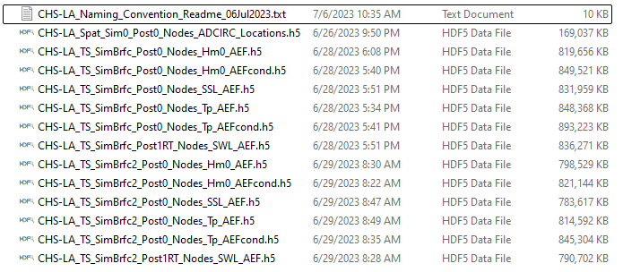
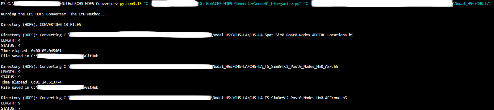

# About
The **CHS HDF5 Converter** is a Python GUI for converting HDF5 files from the [Coastal Hazards System](https://chs.erdc.dren.mil/Home/Library) (CHS) database into a table/CSV format (aka a dataset) while preserving some, but not all, of the original file's metadata. Target audience: USACE staff.

There are two methods labeled the Command Line (CMD) method and the GUI method. [The CMD method](#the-cmd-method) converts HDF5 and ZIP files directly from the command line, including folders containing HDF5 files. [The GUI method](#the-gui-method) allows many more functions such as previewing, filtering, and plotting multiple HDF5 files. All CSV files produced by the app will be saved in the directory above the program's Python files.

# Installation
1. **Compatible Operating Systems**: Successful testing on Windows 10/11 and macOS. Untested for Linux.
1. **Python Interpreter & Environment**
    * Compatible versions: 3.11, 3.12, 3.13
    * This documentation will assume the Python CMD call function is `python`.
1. **Download Program Files**: Assign a directory specifically for the files of this program (ex. `C:\Users\Cyvu37\Documents\CHS_HDF5_Converter`). 
    * Make sure the parent directory of the program directory (ex. `C:\Users\Cyvu37\Documents`) doesn't require administrator access. Converting HDF5 files requires creating a temporary subdirectory *Extracted*.
    * Processing power may vary based on the directory's location.
1. **Install Packages**
    * Option 1: Auto-install packages by running the GUI: `python begin.py`.
    * Option 2: Run `python -m pip install -r requirements.txt`.

# Export vs Import
When the program processes an HDF5 file, it reorganizes the data within the HDF5 file into a table-formatted dataset. From there, the program can "export" and/or "import" the dataset. "Exporting" a dataset means to save the dataset as a CSV file (CSV & GUI methods). "Importing" a dataset means to bring the dataset to the Data Viewer tabs (GUI method only). 

In the GUI method, a user can "export" and "import" the same HDF5 file. This means the program will produce the CSV file ("exported") and "import" the dataset in the Data Viewer tabs ("imported"), not that the program will "convert" the data twice.

In the current version, the Import tab will be permanently disabled once a user "imports" a dataset or more into the program. It's also not possible to import the exported CSV files back into the GUI yet.

# Compatible File Types
The CHS database is extensive and diverse, but each filename has 7 identifiers separated by underscores:

1. **Project / Region / Sub-region**: A string specifying project name, region name or sub-region name, depending on the data structure. Example: `CHS-LA`
1. **Storm / Data**: A string specifying either the storm type or the data type. Example: `TS`
1. **Simulation**: A string that defines the simulation parameters for a specific project. Example: `SimBrfc`
1. **Post-processing**: A string specifying the types of post-processing performed. Note that these may be project-specific. Example: `Post0`
1. **Save Point / Station / Statistics / Storm**: A string specifying either the save point ID, the storm ID, the observation station ID, or the data type. Example: `Nodes`
1. **Model**: A string specifying the model name, and grid number where applicable, for model results. Example: `Hm0`
1. **Result / Input Type**: A string specifying the type of data contained within the file. Example: `AEF`

The examples listed above yield the filename `CHS-LA_TS_SimBrfc_Post0_Nodes_Hm0_AEF.h5`.

As of December 2024, the following identifiers are compatible with the corresponding functions. For example, any filename with `Post0` in ID #4 (`X_X_X_Post0_X_X_X.h5`) can be imported to the GUI for preview and filtering ("Import & Export"), but any filename with `Post96RT` in ID #4 (`X_X_X_Post96RT_X_X_X.h5`) can only be exported as a CSV file ("Export Only"). **NOTE**: There are some problems with importing certain files on macOS, but they can still be exported. You can submit an issue if this happens.

ID # | Import & Export | Export Only
:----|:---------------------------------------------------------------------------|:---------------------
1    | `CHS-LA`, `CHS-NA`, `CHS-TX`, `NACCS`, `SACSNCSEFL`
2    | `CC`, `TC`, `TS`, `XH`, `Spat` | `TH`
3    | All
4    | `Post0`, `Post1RT` | `Post96RT`
5    | All
6    | All
7    | `AEF`\*, `AEFcond`\*, `AEP`, `Locations`, `Peaks`, `STcond`, `Timeseries` | `NLR`, `Params`, `SRR`

\* Yields multiple datasets and CSV files when ID #1 is `NACCS` or `SACSNCSEFL`.

In the Qualifying Files group of the Convert tab, the GUI will auto-remove checkboxes for files that cannot be imported to the GUI.

# The CMD Method
Exports multiple HDF5 or ZIP file into CSV file(s). This can also scan a directory for HDF5 files, including in all subdirectories.

* Requirements
    * The file `code01_h5organize.py`.
    * The complete filepath of the HDF5 file to export.
    * Packages [numpy](https://pypi.org/project/numpy/) and [pandas](https://pypi.org/project/pandas/) for data handling.

* Instructions
    * Open the command line from the program directory.
        * Ex. `C:\Users\Cyvu37\Documents\CHS_HDF5_Converter`
    * Input `python code01_h5organize.py` followed by the complete file or folder path(s).
        * One HDF5 file: `python code01_h5organize.py "C:\Users\Cyvu37\Documents\HDF5 Files\One_Two_Three_Four_Five_Six_Seven.h5"`
        * One ZIP file: `python code01_h5organize.py "C:\Users\Cyvu37\Documents\HDF5 Files\myzip.zip"`
        * One folder: `python code01_h5organize.py "C:\Users\Cyvu37\Documents\HDF5 Files"`
        * One ZIP file and one HDF5 file: `python code01_h5organize.py "C:\myzip.zip" "C:\Users\Cyvu37\Downloads\One_Two_Three_Four_Five_Six_Seven.h5"`
    * Press Enter.

# The GUI Method

Handles all features of the program, including exporting, previewing, filtering, and graphing HDF5 files. Some features only apply to specific file types. Features are listed [here](#features-of-data-viewer).

* Requirements:
    * All files from this project and all packages from `requirements.txt`.
    * HDF5 files or ZIP files containing HDF5 files.

## Instructions
1. Run `python begin_stormsim.py` from the program directory in the command line.
    * The program will first check if your local system has all the required packages. If successful, a GUI will appear.
1. Select HDF5 files and/or ZIP files with `Browse`.
    * The program will make a reference for each compatible HDF5 file from the ZIP file.
    * Any incompatible file will be ignored, including HDF5 files without 6 underscores.
    * You can repeat this process multiple times with `Add`, but duplicate files will be ignored.
1. Select the files you want to export and/or import.
    * See [Export vs Import](#export-vs-import) for more details.
    * If you only "export" HDF5 files, then the GUI will not change its state after "exporting" the files.
    * You can clear the list of files with `Clear`.
1. Highlight filename row(s) with the Search bar.
    * The program will count how many filenames have the substring.
1. Click `Run` when ready.
    * A progress bar will appear in the GUI for all files.
    * You can also check the progress from the command line.
1. Handle any "imported" files with the Data Viewer tabs.
    * You can't go back to the Convert tab without restarting the GUI.

## Features of Data Viewer
* **Filter by Variables**: Each column with unique numerical data or date values is a variable. The program calculates the minimum and maximum values of each variable, and allows the user to filter the dataset by narrowing the variable's range in the Filter group. Applying the filter will establish a new range for that variable until you restart with `Clear All`. 
    * You can add filters one at a time with `Add`.
    * You can also export the filtered dataset (`Current`) or the full dataset (`Full`).
* **Filter by Storm ID (Timeseries only)**: A file with `Timeseries` as ID #7 (`X_X_X_X_X_X_Timeseries.h5`) has too much data to preview, so the default preview only lists the Storm IDs. However, you can filter the data corresponding to each Storm ID and export your filtered dataset. 
    * You can either filter by a Storm ID first and then filter by a variable *or* filter by a variable first and then filter by a Storm ID, but not at the same time.
* **Plotting (Peaks, Timeseries only)**: A file with `Peaks` or `Timeseries` as ID #7 (`X_X_X_X_X_X_Peaks.h5` or `X_X_X_X_X_X_Timeseries.h5`) has enough data for plotting. The Plot tab lets the user pick the variable to plot along with narrowing the date range. 
    * For `Timeseries` data, the user must pick one or more Storm IDs *and* one variable. You can limit the date range for only one Storm ID.